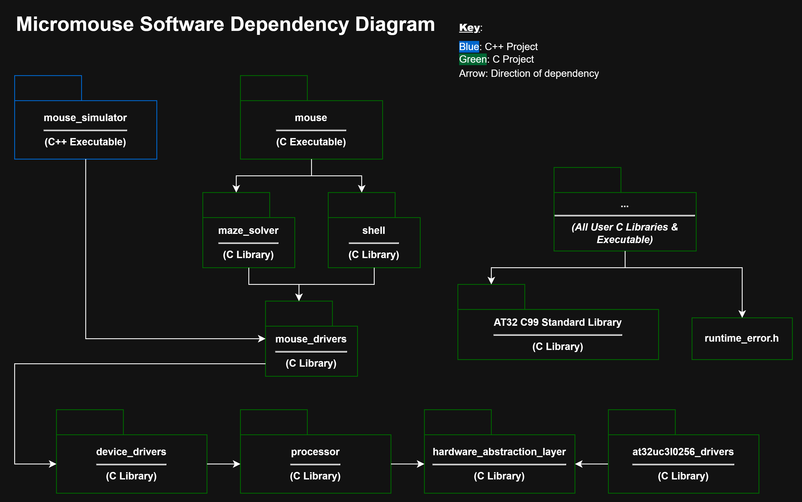
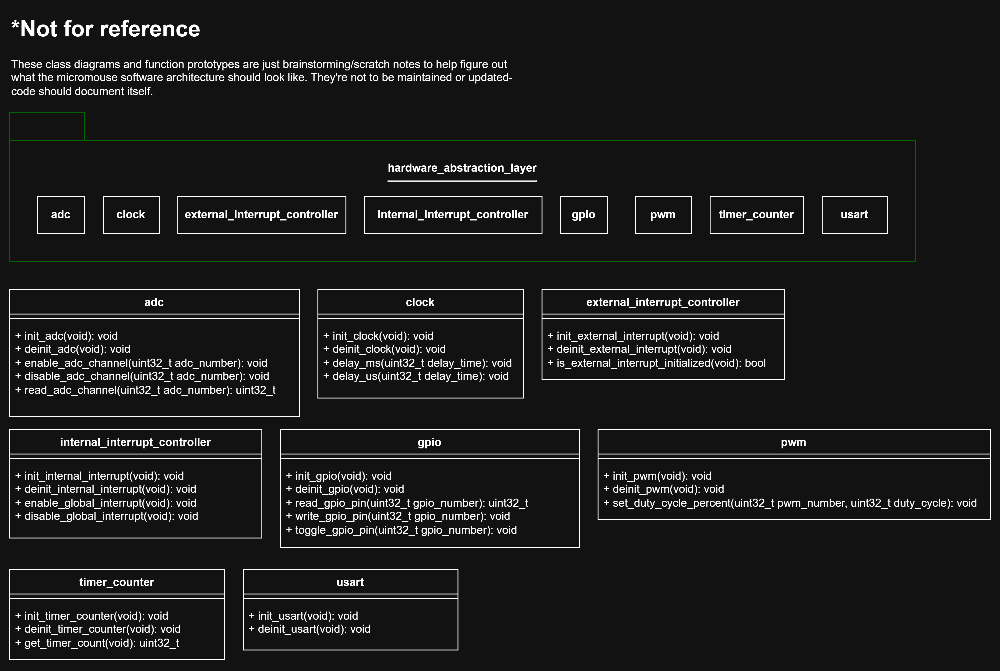
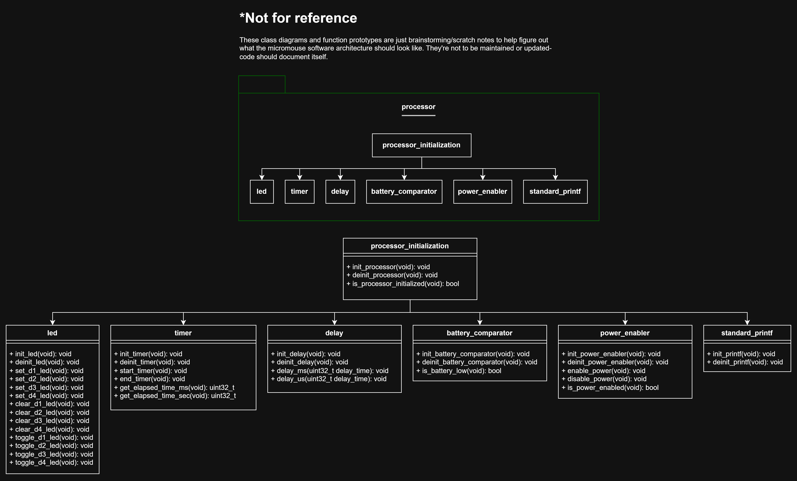
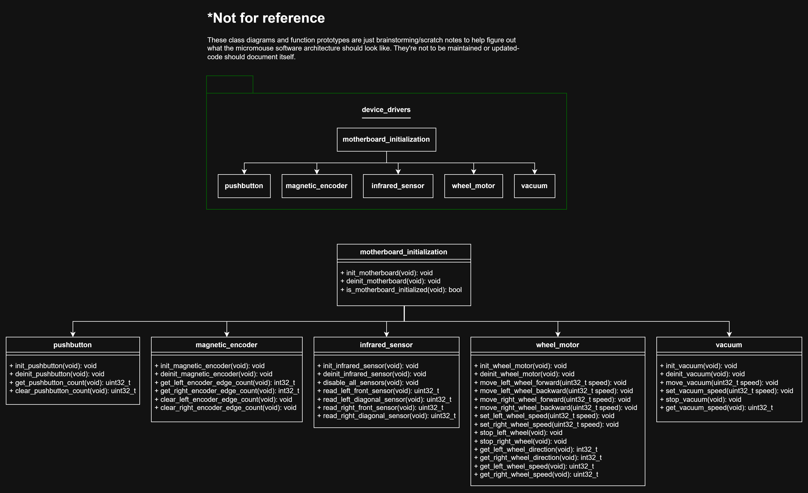
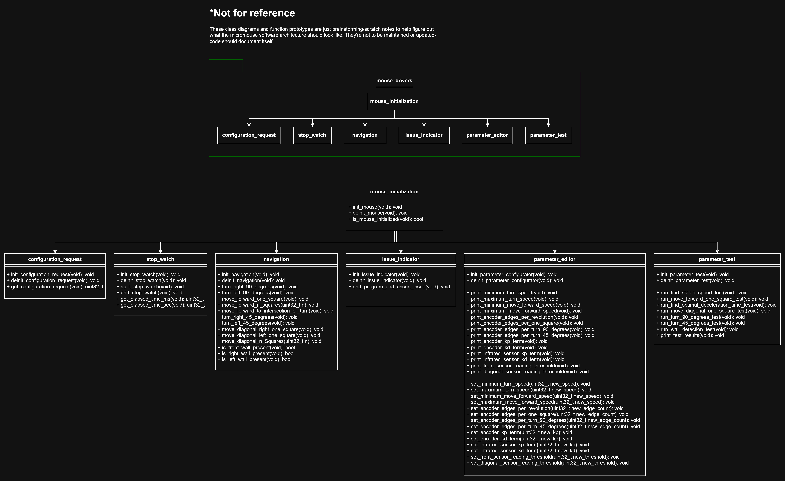
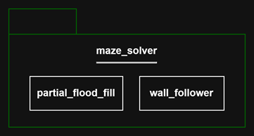
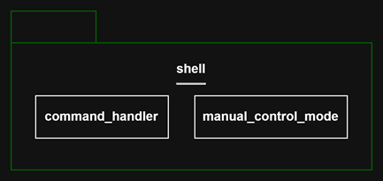
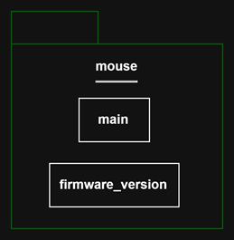
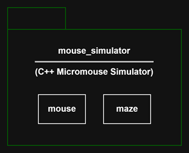

# Software Architecture

Below is a sketch of the software packages that make up the micromouse motherboard firmware.

## `at32uc3l0256_drivers`

- AT32UC3L0256 drivers wrapped to adhere to the hardware abstraction layer
- This layer changes upon switching the motherboard MCU/processor

## `hardware_abstraction_layer`

- Middleware to abstract hardware peripherals/components on a processor like adc, clock, gpio, etc
- Forces low level drivers to adhere to this HAL via dependency inversion
- This layer may expand to support new hardware components on the current and new processors, but shouldn't be swapped otherwise

## `processor`

- Defines the processor and all external devices critical for debugging
- Shouldn't have to swap regardless of what processor is being used

## `device_drivers`

- Defines all external hardware components
- This layer changes upon switching external hardware devices on the motherboard

## `mouse_drivers`

- Interface to control the micromouse for movement and control
- Also provides interfaces for calibration and testing to a particular maze

## `maze_solver`

- Maze solving interface to solve a micromouse maze

## `shell`

- Command line interface for calibration and testing

## `mouse`

- Final executable to be deployed to micromouse hardware
- Includes a minimal firmware version module to print the version of all libraries that make up the final binary, provided by the build configuration system

## `mouse_simulator`

- C++ executable to simulate a micromouse in a virtual maze to generate optimal parameters
